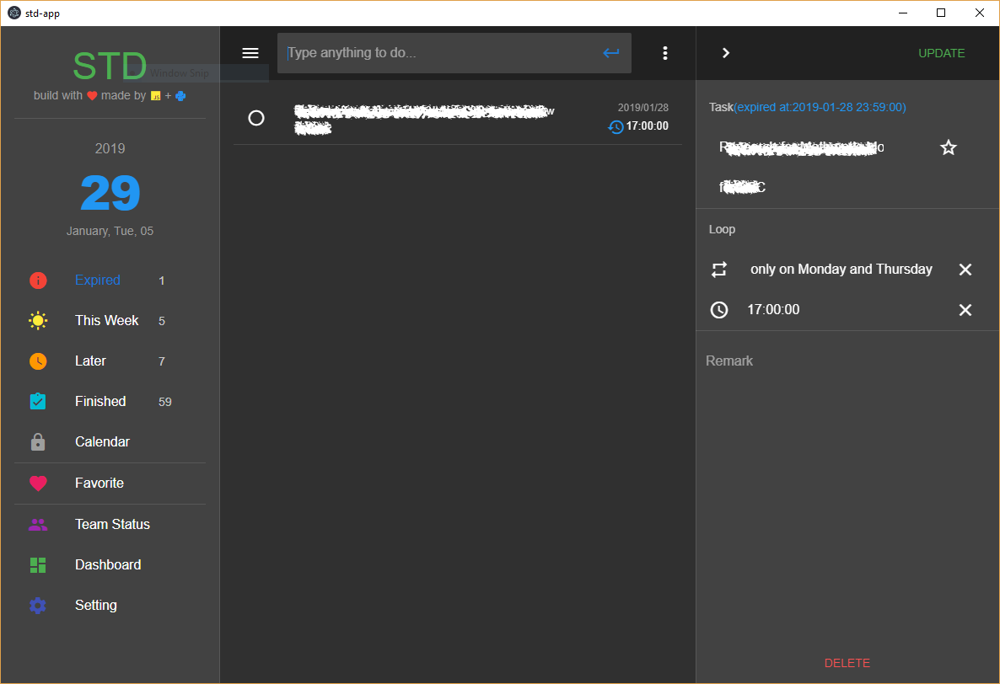

# std-app
It's a to-do app inspired by many apps like *Microsoft To Do* aim to help to arrange recurrence works but also available for one-time tasks.

It's developed by `vue.js` & `vuetify` framework and pack by `electron` which require **vue-cli3** & **electron-vuetify** boilerplate.
## Gallery

## Project setup
install necessary packages
```
yarn install
```
run in test mode
```
yarn electron:serve
```
build for production
```
yarn electron:build
```
## Notice
It's not a standalone app which required a backend, you can edit
from repository [std-api](https://www.github.com/NegativeDearc/std-api) which writen by Python.

Web version can be found at [std](https://www.github.com/NegativeDearc/std).
